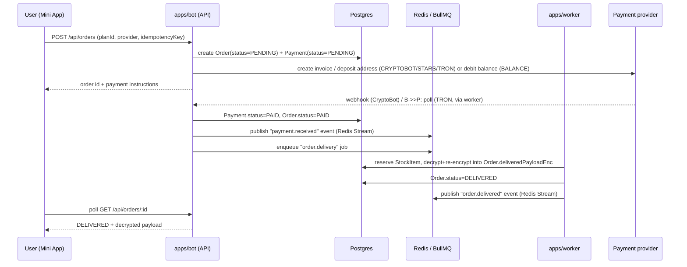

# Architecture

## System overview

```mermaid
flowchart LR
    subgraph Telegram
        TGUser[Telegram User]
        TGChannel[Broadcast Channel]
    end

    subgraph Edge["Caddy (auto HTTPS)"]
        Caddy
    end

    subgraph Apps
        Bot["apps/bot\ngrammY + Fastify\nwebhook + Mini App API + /internal/*"]
        Worker["apps/worker\nBullMQ processors"]
        MiniApp["apps/miniapp\nNext.js Mini App"]
        Landing["apps/landing\nNext.js marketing site"]
        Admin["apps/admin\nNext.js admin panel"]
    end

    subgraph Data
        PG[(Postgres 16)]
        Redis[(Redis 7\nBullMQ + Streams)]
    end

    subgraph External
        CryptoBot[CryptoBot API]
        TronGrid[TronGrid API]
        StarsAPI[Telegram Stars\n(Bot API sendInvoice)]
    end

    TGUser -- updates/webhook --> Caddy --> Bot
    TGUser -- opens Mini App --> Caddy --> MiniApp
    MiniApp -- REST, initData auth --> Caddy --> Bot
    Admin -- REST, JWT auth --> Caddy --> Bot
    Bot -- prisma --> PG
    Bot -- enqueue jobs / publish events --> Redis
    Worker -- prisma --> PG
    Worker -- consume jobs / events --> Redis
    Worker -- poll --> TronGrid
    Bot -- webhook --> CryptoBot
    Bot -- sendInvoice --> StarsAPI
    Worker -- sendMessage --> TGChannel
```

## Packages and apps

- **`@tgshop/db`** — the only place the Prisma schema lives. Exports a
  cached `prisma` client singleton plus every generated enum/type. All other
  packages/apps depend on this for data access; nothing talks to Postgres
  directly except through this client.
- **`@tgshop/core`** — pure domain logic, no I/O except the ledger's Prisma
  transaction client (passed in by the caller, never opened itself):
  - `money.ts` — integer-only money math (USD cents, USDT 6-decimals as
    BigInt, Stars as whole ints), half-up rounding, no floats anywhere.
  - `pricing.ts` — `computeOrderTotal()`: plan price × qty, plan discount,
    optional promo, all in integer cents.
  - `crypto.ts` — AES-256-GCM encrypt/decrypt for `StockItem.payloadEnc` /
    `Order.deliveredPayloadEnc`, format `v1:<iv>:<tag>:<ct>`, byte-identical
    to `packages/db/prisma/seed.ts`.
  - `ledger.ts` — append-only `BalanceTransaction` writes (`credit`/`debit`),
    serialized per-user via `pg_advisory_xact_lock`, idempotent via
    `IdempotencyRecord`.
  - `errors.ts` — typed `DomainError` subclasses used across the stack.
- **Payment providers** live in the bot, `apps/bot/src/payments/` — one module
  per hosted `PaymentProvider` (`cryptobot.ts`, `stars.ts`): invoice creation,
  webhook signature verification and provider-status → `PaymentStatus`/
  `OrderStatus` mapping; the worker's `payments-poll` job is the polling
  fallback. USDT-TRC20 is not an adapter — the bot tags each invoice amount
  (`tron.ts`) and the worker's chain-scan job watches the owner's static wallet
  (see `docs/PAYMENTS.md`).
- **`@tgshop/ui`** — design tokens (single file, `packages/ui/src/tokens`),
  a Tailwind preset, and shared React components (`Button`, `Card`, `Badge`,
  `Skeleton`, `Money`) consumed by `miniapp`, `landing`, and `admin`.
- **`apps/bot`** — grammY bot (long-poll in dev, webhook in prod) plus a
  Fastify HTTP server exposing three surfaces on one process:
  1. `POST /webhook/telegram/:secret` — Telegram Bot API updates (`X-Telegram-Bot-Api-Secret-Token` checked against `WEBHOOK_SECRET`).
  2. `/api/*` — the Mini App's REST API, authenticated via Telegram WebApp `initData`.
  3. `/internal/*` — service-to-service endpoints authenticated via a
     `SERVICE_TOKEN` bearer header, used by the worker and by future LLM
     agents (see `AGENT_PLAN.md`).
  4. `/webhooks/*` — inbound provider webhooks (CryptoBot today).
- **`apps/worker`** — BullMQ processors consuming queues backed by Redis:
  payment reconciliation, order delivery, TRON polling/sweeping, scheduled
  broadcast sends, subscription-expiry reminders. Horizontally scalable
  (idempotent jobs, advisory-locked ledger writes).
- **`apps/miniapp`** / **`apps/landing`** / **`apps/admin`** — Next.js 14 App
  Router frontends, styled via `@tgshop/ui`'s Tailwind preset.

## Data flow: order lifecycle (high level)



See `docs/PAYMENTS.md` for the full per-provider diagrams and every failure
mode (double-spend, missed webhook, underpayment, late payment, refund).

## Redis usage

Redis serves two distinct roles, both configured with `appendonly yes` for
durability:

1. **BullMQ queues** — reliable job processing for delivery, reconciliation,
   TRON polling, and broadcast sending. Jobs carry an idempotency key so
   retries after a crash are safe.
2. **Redis Streams event bus** — domain events (`order.paid`,
   `order.delivered`, `stock.low`, `payment.underpaid`, etc.) published by
   `apps/bot`/`apps/worker` for any consumer to subscribe to, including a
   future LLM agent. See `docs/AGENT_PLAN.md` for the concrete stream/event
   names.
