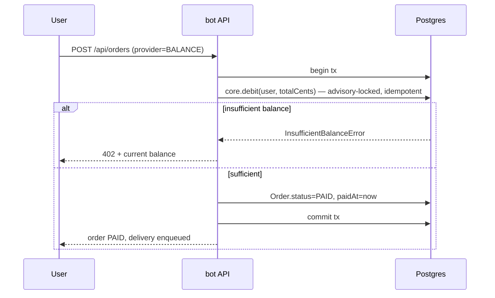
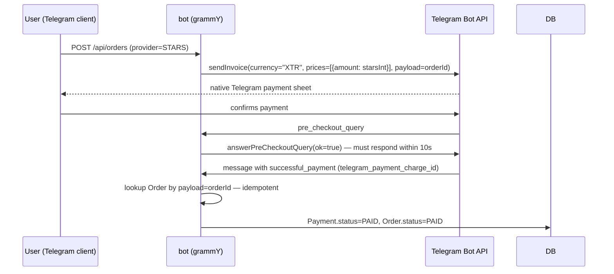
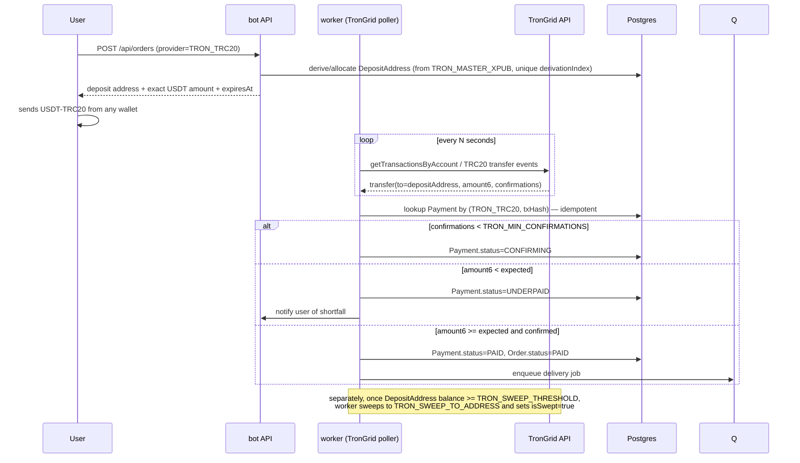

# Payments

All four `PaymentProvider` values — `BALANCE`, `CRYPTOBOT`, `STARS`,
`TRON_TRC20` — share one state machine on `Order.status`
(`PENDING → PAID → DELIVERING → DELIVERED`, with `FAILED`/`EXPIRED`/
`REFUNDED` as terminal off-ramps) and a parallel `Payment.status`
(`PENDING → CONFIRMING → PAID`, with `UNDERPAID`/`EXPIRED`/`FAILED`
off-ramps). Money is always integer: `amountCents` (Int) for USD,
`Payment.amount` (BigInt) interpreted per-`asset` (USDT: 6 decimals, Stars:
whole units).

## Idempotency

Every provider write path is protected by one of:

- `Order.idempotencyKey` (`@unique`) — the client-supplied key for
  `POST /api/orders`; a retried request with the same key returns the
  existing order rather than creating a duplicate.
- `Payment` `@@unique([provider, txHash])` and
  `@@unique([provider, providerInvoiceId])` — a webhook or poll result that
  matches an already-processed `(provider, txHash)`/`(provider,
  providerInvoiceId)` pair is a no-op, not a double-credit. Both indexes
  are on nullable columns; Postgres treats `NULL` as distinct from `NULL`,
  so this only constrains rows where the pair is actually populated
  (intentional — plenty of `Payment` rows never get a `txHash`, e.g. Stars).
- `IdempotencyRecord` (scope `"ledger"`) — every `BalanceTransaction` write
  via `@tgshop/core`'s `credit()`/`debit()` is keyed by an idempotency key
  and short-circuits to the previously computed result if replayed.

## Per-provider flows

### BALANCE

No external round-trip — the debit and the `Order.status=PAID` transition
happen in the same Postgres transaction, so this path has no webhook/polling
failure modes of its own (see "Refund" below for the reverse direction).

### CRYPTOBOT

**Signature verification**: CryptoBot signs the raw JSON body with
`HMAC_SHA256(secret_key, body)` where `secret_key = SHA256(CRYPTOBOT_API_TOKEN)`
(raw bytes, not hex), hex-encoded, sent in the `Crypto-Pay-API-Signature`
header. Verify with a constant-time comparison
(`@tgshop/core`'s `safeEqual()`). See
`bruno/tgshop/webhook-simulators/cryptobot-invoice-paid.bru` for a working
signing snippet you can run locally.

### STARS

Stars amounts are always the integer computed by
`usdCentsToStars()` — never re-derived from a float — so what the user is
charged always matches what `Order.amountCents` implies.

### TRON_TRC20 (USDT)

Use `bruno/tgshop/webhook-simulators/tron-usdt-deposit.bru` (and the
`-underpayment` variant) to exercise this without a real testnet transfer.
They drive `scripts/fake-trongrid.mjs`, a local stand-in for api.trongrid.io:
TRON has no push webhooks, so the only faithful simulation is one the real
polling code discovers. Point the worker at it with
`TRONGRID_API_BASE=http://localhost:8099`.

### Sweeping deposits to the treasury

Deposits land on per-invoice addresses derived at `m/44'/195'/0'/0/<index>`,
so consolidating them means signing one transfer per address.

**An xpub cannot sweep.** `TRON_MASTER_XPUB` derives deposit *addresses* and
nothing more; moving funds needs the matching private keys, so live sweeping
requires `TRON_MASTER_XPRV` (AES-256-GCM encrypted under `ENCRYPTION_KEY`, in
the same `v1:<iv>:<tag>:<ct>` keystore format as the stock payloads).

**Energy.** A TRC-20 transfer from a fresh address needs TRX for energy and
bandwidth, and deposit addresses receive only USDT. The sweeper therefore
reads the address's TRX balance, tops it up from the hot wallet
(`TRON_HOT_WALLET_KEY`) when below `TRON_SWEEP_ENERGY_RESERVE_SUN`, waits for
that top-up to confirm, and only then sweeps. If the hot wallet itself falls
below `TRON_SWEEP_HOT_WALLET_FLOOR_SUN` it raises a `low_trx` admin alert and
skips, rather than stranding itself unable to fund any sweep at all.

**No double-sweep.** The address is claimed with a compare-and-swap
(`UPDATE ... WHERE address = $1 AND "isSwept" = false`) *before* broadcasting.
Under READ COMMITTED a second worker blocks on the row lock, re-evaluates the
predicate, and matches zero rows — so the guard holds across concurrent jobs,
processes and machines. The claim is taken before the broadcast on purpose: if
the process dies mid-sweep the claim stays held and the funds are recoverable
by hand, whereas a double broadcast is not recoverable.

**All-or-nothing.** If any inbound deposit to that address is still
unconfirmed, the address is skipped rather than partially swept — a partial
sweep against a lagging balance read could produce a duplicate broadcast on
the next pass.

**Read-only mode** is the default (`TRON_SWEEP_READ_ONLY=true`). The sweeper
logs what it *would* sweep and signs nothing, which is the correct posture
when no hot key is deployed; consolidation is then a manual operation.

## Failure modes

### Double-spend / duplicate webhook delivery

**Risk**: CryptoBot (or any provider) redelivers the same webhook (network
retry, at-least-once delivery semantics), or a malicious actor replays a
captured payload.

**Mitigation**: every write path looks up the existing `Payment` by its
unique `(provider, providerInvoiceId)` or `(provider, txHash)` pair *before*
mutating state, and is a no-op if a matching `PAID` row already exists.
Signature verification rejects payloads that aren't from the real provider
(CryptoBot); TRON needs no such check because nothing is pushed to us — the
worker only ever believes transfers it read from TronGrid itself.
The `Order.status` transition itself uses `@tgshop/core`'s state-machine
guard (`OrderStateError` if an illegal transition, e.g. `DELIVERED → PAID`,
is attempted), so a duplicate "paid" signal after delivery cannot regress
the order.

### Missed webhook (CryptoBot never calls back)

**Risk**: the webhook HTTP request never arrives (network partition, DNS
issue, CryptoBot-side outage) even though the invoice was actually paid.

**Mitigation**: the worker's reconciliation job (scheduled every 30s, and
triggerable on demand via `POST /internal/reconcile`) re-queries CryptoBot's
`getInvoices` for every `Payment` still `PENDING`/`CONFIRMING` and applies
the same idempotent settlement the webhook would have: order payments settle
and deliver, `topup_*` payments credit the balance under the webhook's own
`topup:<paymentId>` ledger key. This is the same mechanism that would catch
a webhook-signature verification bug silently dropping legitimate callbacks.

### Underpayment (TRON)

**Risk**: user sends less USDT than the order requires (wrong amount, or a
wallet that deducts network fees from the send amount rather than adding
them).

**Mitigation**: `Payment.status=UNDERPAID` is a distinct terminal-ish state
(not `FAILED` — the funds did arrive, just not enough). The user is notified
of the shortfall and can either send the difference to the same
`DepositAddress` (the worker re-evaluates cumulative deposits against the
order total) or request a refund of the partial amount to their balance
(`LedgerType.REFUND`, `BalanceTransaction` credit) rather than to a TRON
address, since consolidating dust back out on-chain rarely nets positive
after fees.

### Late payment (after Order.expiresAt)

**Risk**: user pays after the order/invoice has already expired (CryptoBot
invoices and TRON deposit windows both have a configured TTL reflected in
`Order.expiresAt`).

**Mitigation**: the order is never silently resurrected days later with
stale pricing/stock assumptions. Per rail:

- **TRON**: `chain-scan` detects the deposit against the expired order,
  credits the full received amount to the user's `BalanceTransaction`
  ledger instead of delivering, and notifies the user — funds are not lost,
  and a fresh order can be placed from balance.
- **CryptoBot**: `payments-poll` finds the provider-paid invoice attached to
  the closed order, marks the `Payment` `PAID` (the provider's truth), and
  flags a reconcile mismatch (`kind="paid_order_closed"`) — an `AuditLog`
  anomaly row plus a `payment.reconcile_mismatch` event — for a human to
  decide between crediting balance and refunding through CryptoBot. The
  money sits with CryptoBot either way, so deliberately nothing is credited
  automatically.

### Refund

**Risk**: an order needs to be refunded post-delivery (chargeback risk,
customer support decision, delivered-but-defective stock).

**Mitigation**: refunds always land as a `BalanceTransaction`
(`LedgerType.REFUND`, positive `amountCents`) credited via `@tgshop/core`'s
`credit()` — never as a reversed on-chain TRON transfer or a CryptoBot
refund API call, both of which are unreliable/slow/fee-bearing for small
amounts. `Order.status` moves to `REFUNDED` (a terminal state; delivery is
not "undone" — the underlying `StockItem`/code is presumed compromised once
delivered and is not returned to the `AVAILABLE` pool). Every refund is
also written to `AuditLog` (`actorType="admin"` or `"agent"`) with the
reason in `diff`.

## Reconciliation & anomaly detection

`POST /internal/reconcile` (bearer-auth via `SERVICE_TOKEN`) and the
worker's scheduled equivalent walk `Payment` rows that are not yet in a
terminal state, re-check them against the provider's own source of truth
(CryptoBot `getInvoices`, TronGrid transaction history), and write any
mismatch to `AuditLog` for a human (or the future agent described in
`docs/AGENT_PLAN.md`) to review. This is the single mechanism that covers
missed webhooks, provider-side status flips, and stuck `CONFIRMING` payments
in one pass.
